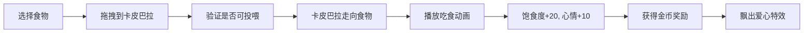
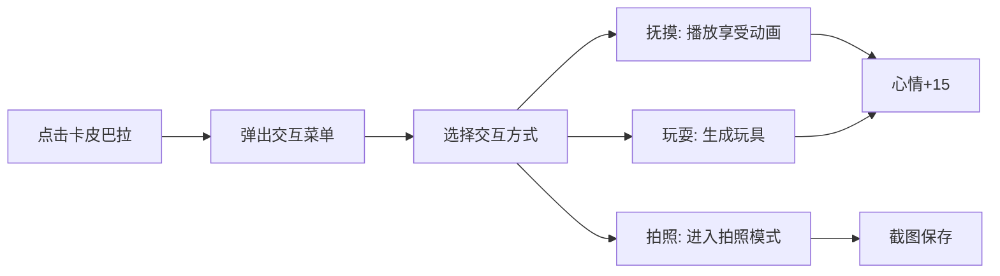

## 1. 产品概述

一款纯前端的3D卡皮巴拉（水豚）动物园模拟经营游戏。玩家可以投喂可爱的卡皮巴拉、与它们互动，观察它们在自然环境中的各种行为表现。游戏采用治愈系风格，营造放松愉悦的游玩体验。

## 2. 核心功能

### 2.1 用户角色

纯单机前端游戏，无角色区分。

### 2.2 功能模块

1. **主游戏场景**：3D动物园环境，包含多只卡皮巴拉、场景装饰、天气系统
2. **投喂系统**：选择不同食物投喂卡皮巴拉，触发不同反应动画
3. **交互系统**：点击卡皮巴拉触发互动（抚摸、玩耍、合影）
4. **状态面板**：显示每只卡皮巴拉的心情值、饱食度、清洁度
5. **商店系统**：解锁新食物和装饰品

### 2.3 页面详情

| 页面名称 | 模块名称 | 功能描述 |
|----------|----------|----------|
| 主游戏场景 | 3D场景渲染 | Three.js渲染3D环境，包含草地、水池、树木等 |
| 主游戏场景 | 卡皮巴拉模型 | 多只卡皮巴拉的3D模型，具有待机、行走、吃食、泡澡等动画 |
| 主游戏场景 | 视角控制 | 鼠标拖拽旋转视角，滚轮缩放，右键平移 |
| 投喂系统 | 食物选择面板 | 底部悬浮面板，展示可选食物（青草、胡萝卜、西瓜等） |
| 投喂系统 | 投喂交互 | 拖拽食物到卡皮巴拉身上或点击投喂 |
| 投喂系统 | 吃食动画 | 卡皮巴拉走向食物并播放吃食动画，头顶飘出爱心 |
| 交互系统 | 点击交互 | 点击卡皮巴拉弹出交互选项（抚摸、玩耍、拍照） |
| 交互系统 | 抚摸动画 | 卡皮巴拉眯眼享受，播放呼噜声效 |
| 交互系统 | 玩耍动画 | 卡皮巴拉追逐小球或翻滚 |
| 交互系统 | 拍照模式 | 固定视角，添加滤镜和贴纸，截图下载 |
| 状态面板 | 属性显示 | 悬浮卡片显示心情（爱心）、饱食度（汉堡）、清洁度（水滴） |
| 状态面板 | 属性变化 | 随时间自然衰减，投喂/互动后恢复 |
| 商店系统 | 商品列表 | 使用金币购买新食物或装饰 |
| 商店系统 | 金币获取 | 互动获得金币奖励 |

## 3. 核心流程

### 3.1 投喂流程

### 3.2 交互流程

## 4. 用户界面设计

### 4.1 设计风格

- **主色调**：暖绿色系（草地绿 #7CB342、泥土棕 #8D6E63）、温暖阳光感
- **辅助色**：水面蓝（#4FC3F7）、天空橙黄（#FFB74D）
- **按钮风格**：圆润3D按钮，带轻微阴影和悬浮效果
- **字体**：使用圆润可爱的字体，标题用 Nunito，正文用 Quicksand
- **整体风格**：治愈系、低多边形（Low Poly）风格、温暖明亮
- **图标**：使用emoji风格的图标

### 4.2 页面设计概览

| 页面名称 | 模块名称 | UI元素 |
|----------|----------|--------|
| 主游戏场景 | 天空背景 | 渐变天空，白云缓慢飘动 |
| 主游戏场景 | 地面草地 | 低多边形草地，带微风摇曳动画 |
| 主游戏场景 | 水池 | 半透明水面，带波纹效果 |
| 主游戏场景 | 装饰物 | 树木、石头、花朵，随机分布 |
| 投喂面板 | 食物栏 | 底部横向排列食物图标，悬浮效果 |
| 交互菜单 | 弹出菜单 | 圆形气泡菜单，从卡皮巴拉头顶弹出 |
| 状态面板 | 属性卡片 | 半透明圆角卡片，进度条显示 |
| 商店面板 | 商品网格 | 2x2网格展示商品，价格和购买按钮 |

### 4.3 响应式

- 桌面端优先设计
- 支持1920x1080及以上分辨率
- 鼠标交互为主，支持键盘快捷键

### 4.4 3D场景指导

- **环境氛围**：温暖明亮的白天场景，阳光感、治愈系
- **光照设置**：主方向光（模拟太阳）+ 环境光 + 半球光，添加柔和阴影
- **相机设置**：透视相机，初始45度俯视角度，支持自由旋转和缩放
- **构图焦点**：场景中心为水池和主要卡皮巴拉活动区域
- **交互动画**：点击水波纹扩散、爱心粒子飘升、金币收集动画
- **后处理效果**：轻微泛光（Bloom）、色调映射
- **资源方案**：使用Three.js几何体组合构建Low Poly风格模型（无需外部模型文件）
- **性能预算**：总三角面数控制在5万以内，60FPS目标帧率
