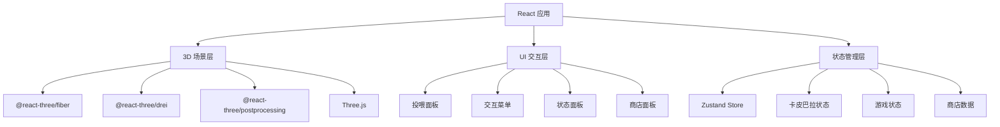

## 1. 架构设计



## 2. 技术描述

- **前端框架**：React@18 + TypeScript
- **构建工具**：Vite
- **3D渲染**：Three.js + @react-three/fiber + @react-three/drei
- **后处理**：@react-three/postprocessing（Bloom效果）
- **状态管理**：Zustand
- **样式方案**：Tailwind CSS
- **动画库**：@react-spring/three（3D动画）

## 3. 路由定义

| 路由 | 说明 |
|------|------|
| / | 主游戏页面，包含3D场景和UI覆盖层 |

## 4. 数据模型

### 4.1 卡皮巴拉数据

```typescript
interface Capybara {
  id: string;
  name: string;           // 名字
  position: [number, number, number];  // 3D位置
  mood: number;           // 心情值 0-100
  hunger: number;         // 饱食度 0-100
  cleanliness: number;    // 清洁度 0-100
  level: number;          // 等级
  experience: number;     // 经验值
  currentAnimation: 'idle' | 'walking' | 'eating' | 'bathing' | 'playing' | 'happy';
  targetPosition: [number, number, number] | null;  // 移动目标
}
```

### 4.2 食物数据

```typescript
interface Food {
  id: string;
  name: string;
  icon: string;           // emoji图标
  hungerRestore: number;  // 恢复饱食度
  moodBoost: number;      // 提升心情
  goldReward: number;     // 金币奖励
  unlockCost: number;     // 解锁价格（0表示已解锁）
}
```

### 4.3 游戏状态数据

```typescript
interface GameState {
  gold: number;           // 当前金币
  capybaras: Capybara[];  // 卡皮巴拉列表
  unlockedFoods: string[]; // 已解锁食物ID
  decorations: string[];   // 已购买的装饰
  lastTick: number;        // 上次状态更新时间戳
}
```

## 5. 组件架构

```
src/
├── components/
│   ├── game/
│   │   ├── GameScene.tsx          // 主3D场景容器
│   │   ├── Capybara.tsx           // 单个卡皮巴拉3D组件
│   │   ├── CapybaraModel.tsx      // 卡皮巴拉LowPoly模型
│   │   ├── Environment.tsx        // 环境场景（草地、水池、树木）
│   │   ├── FoodItem.tsx           // 掉落的食物3D模型
│   │   └── ParticleEffects.tsx    // 粒子特效（爱心、金币）
│   ├── ui/
│   │   ├── FoodPanel.tsx          // 底部食物选择面板
│   │   ├── ActionBar.tsx          // 交互操作按钮
│   │   ├── StatusCard.tsx         // 卡皮巴拉状态悬浮卡片
│   │   ├── ShopPanel.tsx          // 商店面板
│   │   └── TopBar.tsx             // 顶部状态栏（金币、设置）
│   └── common/
│       └── Tooltip.tsx            // 提示气泡组件
├── hooks/
│   ├── useCapybaraAI.ts           // 卡皮巴拉行为AI逻辑
│   ├── useGameLoop.ts             // 游戏主循环
│   └── useDragDrop.ts             // 拖拽投喂逻辑
├── store/
│   └── gameStore.ts               // Zustand全局状态
├── utils/
│   ├── animations.ts              // 动画配置
│   ├── foodData.ts                // 食物数据定义
│   └── geometry.ts                // LowPoly几何体生成工具
├── types/
│   └── game.ts                    // TypeScript类型定义
├── pages/
│   └── GamePage.tsx               // 主游戏页面
├── App.tsx
└── main.tsx
```

## 6. 3D模型实现方案

### 6.1 卡皮巴拉LowPoly模型

使用Three.js基础几何体组合构建：
- **身体**：BoxGeometry + MeshNormalMaterial（圆角处理）
- **头部**：SphereGeometry 压扁
- **耳朵**：小圆锥体
- **四肢**：圆柱体
- **尾巴**：小球体

材质：MeshStandardMaterial，暖棕色系

### 6.2 场景元素

- **地面**：CircleGeometry + 低多边形顶点扰动
- **水池**：CircleGeometry + 半透明蓝色材质 + 顶点动画模拟水波
- **树木**：CylinderGeometry（树干）+ ConeGeometry（树冠）
- **石头**：IcosahedronGeometry + 顶点随机偏移
- **草地装饰**：多个小ConeGeometry随机散布

### 6.3 动画实现

- 使用@react-spring/three实现平滑动画过渡
- 待机动画：轻微上下浮动（呼吸效果）
- 行走动画：四肢交替旋转
- 吃食动画：头部朝向食物，上下点头
- 心情好：跳跃或转圈
- 使用rAF循环更新位置插值
